# Arquitectura del Sistema de Autenticación

## Diagrama de Arquitectura General

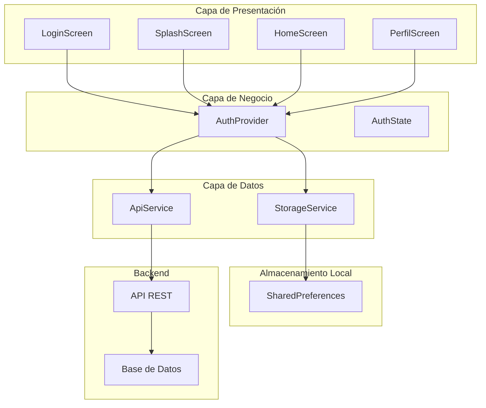

## Flujo de Datos Detallado

### 1. Inicialización de la App

```mermaid
flowchart TD
    A[App inicia] --> B[ProviderScope]
    B --> C[MyApp]
    C --> D[initialize()]
    D --> E[StorageService.hasValidSession()]
    E --> F{¿Hay sesión?}
    F -->|Sí| G[restoreSession()]
    F -->|No| H[ir a LoginScreen]
    G --> I[getToken() + getUser()]
    I --> J[setState(usuario)]
    J --> K[ir a HomeScreen]
```

### 2. Proceso de Login

```mermaid
flowchart TD
    A[Usuario ingresa datos] --> B[Validar formulario]
    B --> C[AuthProvider.login()]
    C --> D[ApiService.login()]
    D --> E[POST /api/login]
    E --> F{¿Respuesta exitosa?}
    F -->|Sí| G[saveToken()]
    F -->|No| H[Mostrar error]
    G --> I[saveUser()]
    I --> J[setRememberMe()]
    J --> K[setLastLogin()]
    K --> L[setState(usuario)]
    L --> M[Navegar a Home]
```

### 3. Gestión de Estado

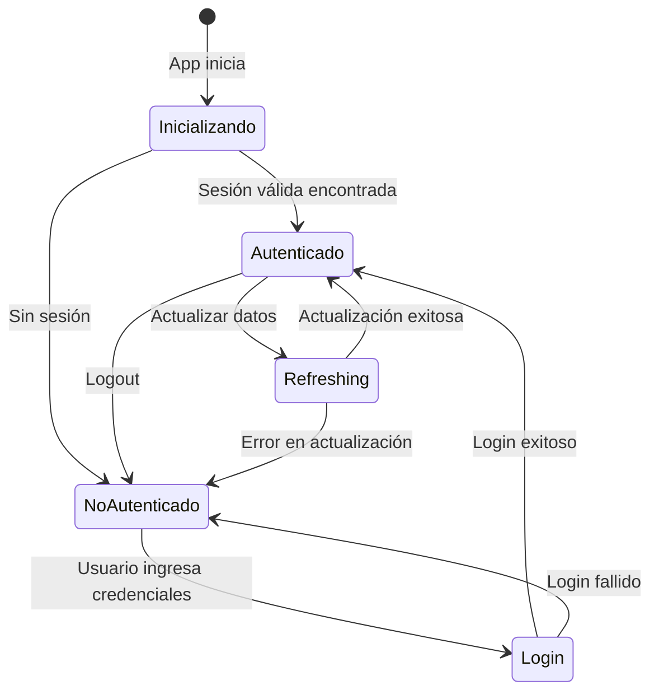

## Estructura de Componentes

### StorageService - Gestión de Datos Locales

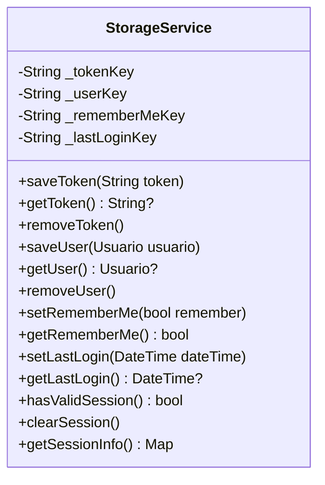

### ApiService - Comunicación con Backend

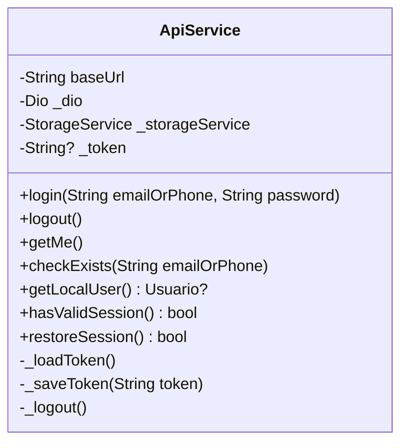

### AuthProvider - Gestión de Estado

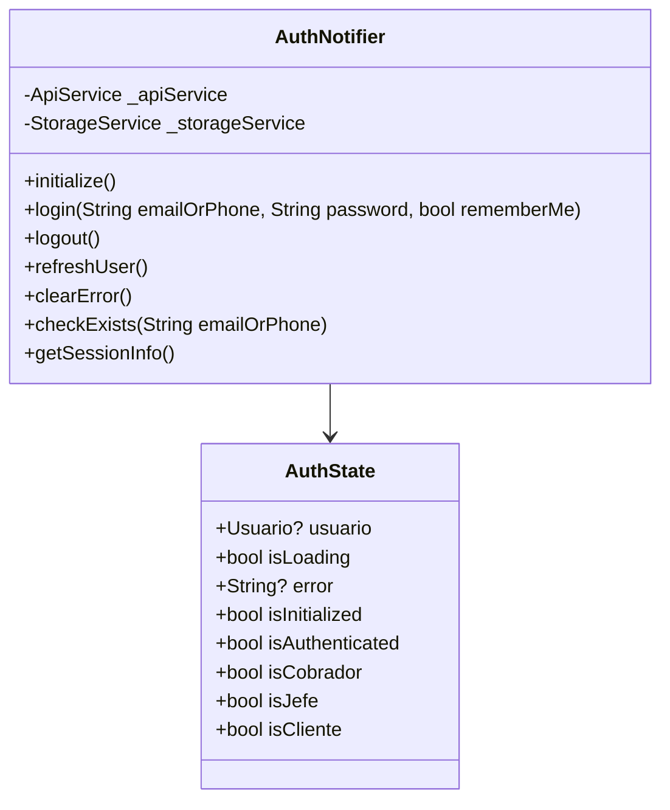

## Flujo de Datos en Memoria

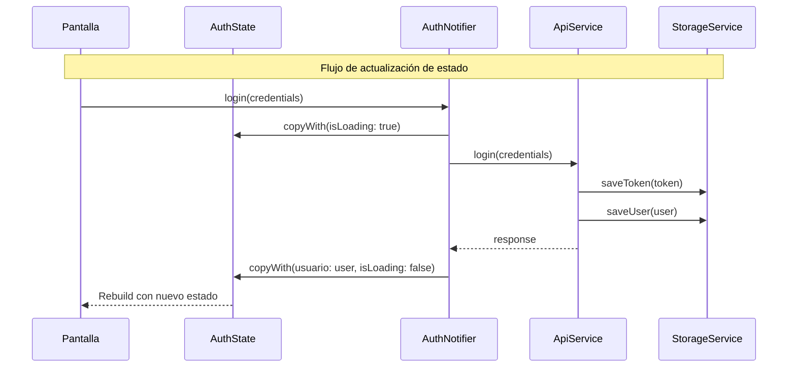

## Manejo de Errores

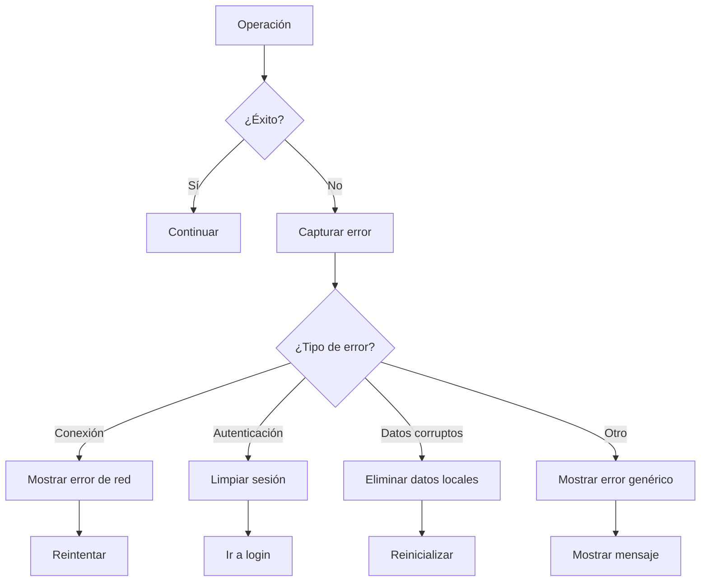

## Seguridad y Validación

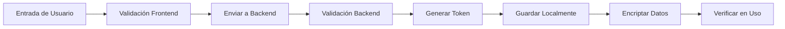

## Optimizaciones Implementadas

### 1. Carga Lazy
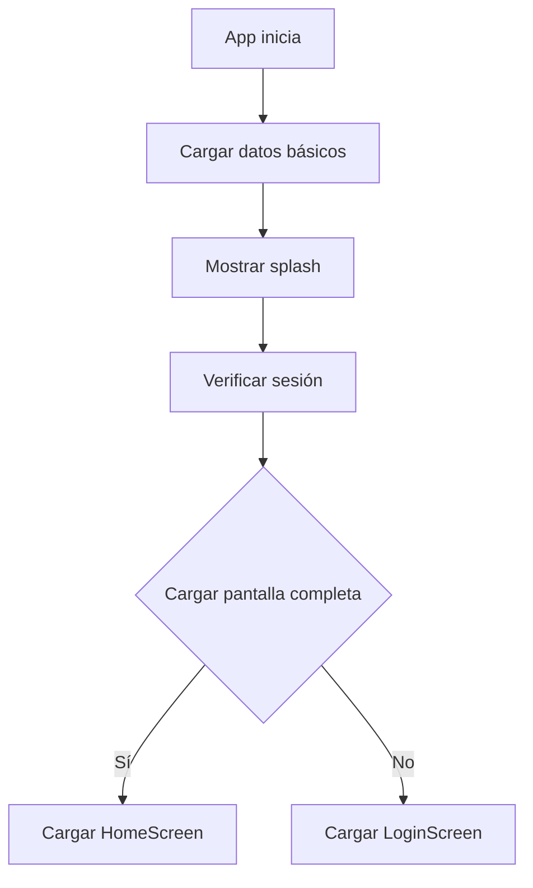

### 2. Cache de Datos
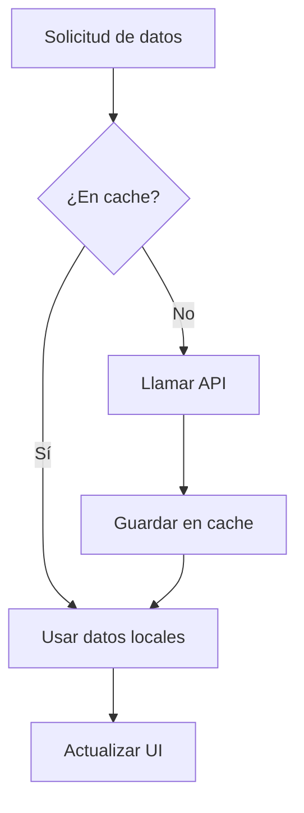

### 3. Manejo Offline
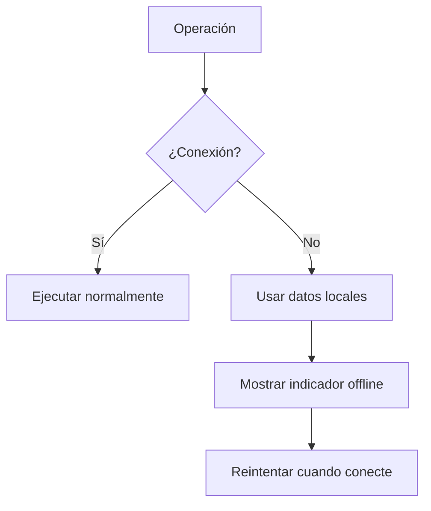

## Métricas y Monitoreo

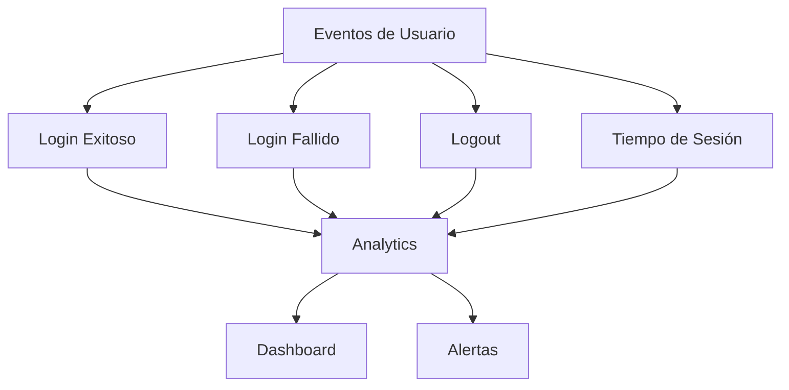

## Consideraciones de Performance

1. **Inicialización rápida**: Verificación de sesión en paralelo
2. **Carga progresiva**: Datos críticos primero
3. **Cache inteligente**: Datos de usuario en memoria
4. **Limpieza automática**: Datos obsoletos se eliminan
5. **Optimización de red**: Requests agrupados

## Escalabilidad

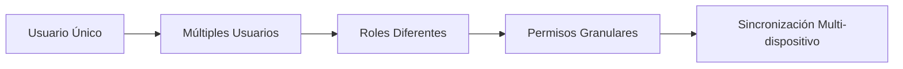

Esta arquitectura proporciona una base sólida para el sistema de autenticación, con separación clara de responsabilidades, manejo robusto de errores y optimizaciones para una mejor experiencia de usuario. 