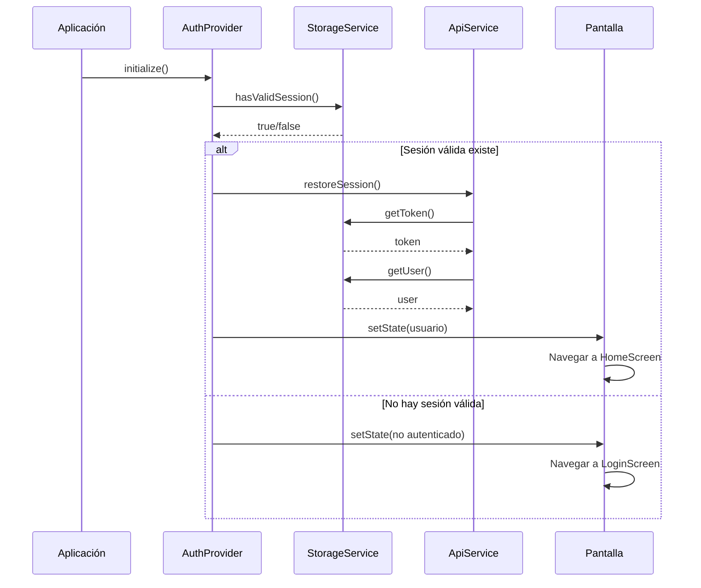
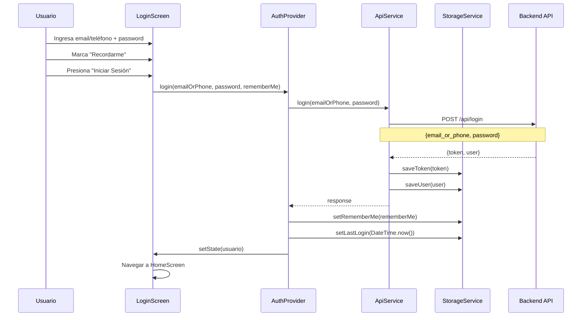
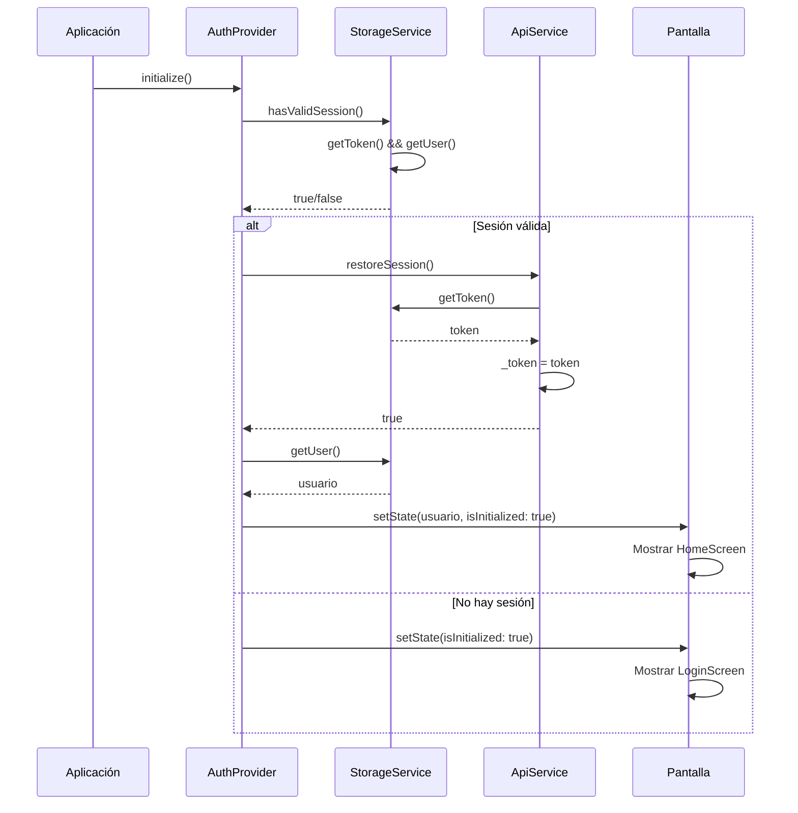
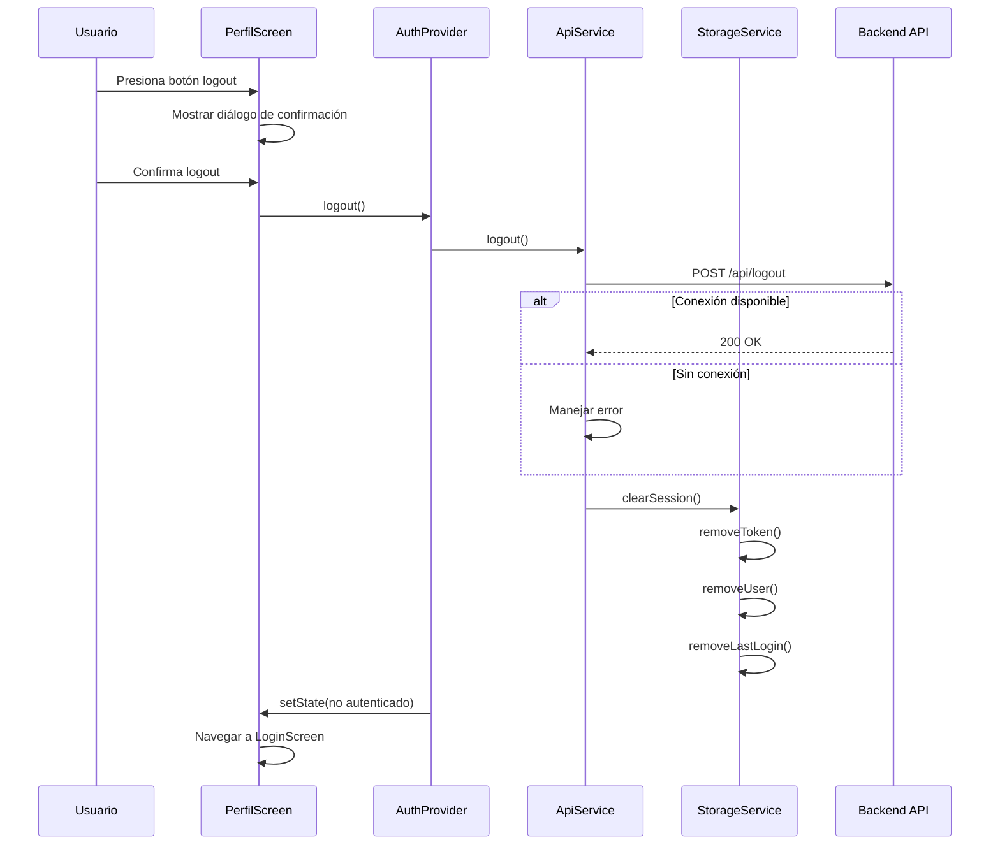
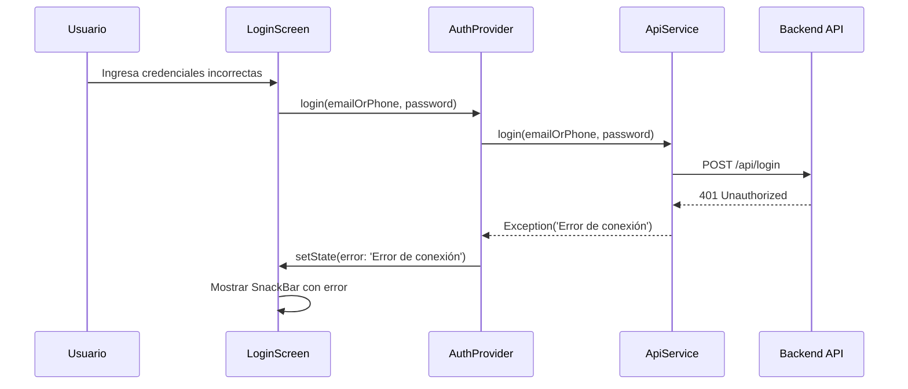
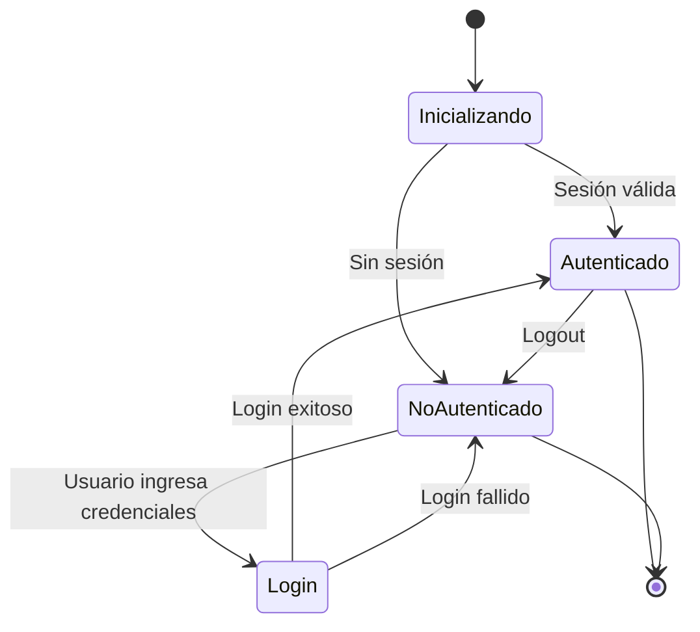
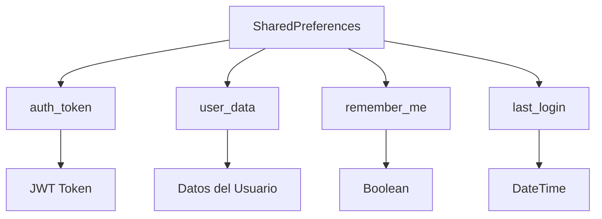
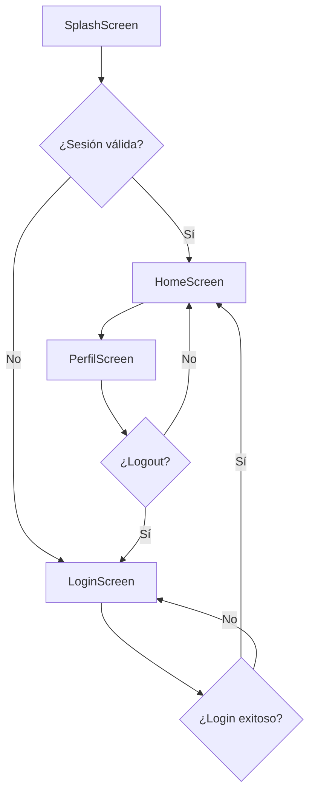

# Diagrama de Secuencia - Sistema de Login

## Flujo de Autenticación Completo

### 1. Inicialización de la Aplicación

### 2. Proceso de Login

### 3. Verificación de Sesión en Inicio

### 4. Logout

### 5. Flujo de Errores

## Componentes del Sistema

### StorageService
- **saveToken()**: Guarda el token JWT
- **getToken()**: Obtiene el token guardado
- **saveUser()**: Guarda datos del usuario
- **getUser()**: Obtiene datos del usuario
- **setRememberMe()**: Guarda preferencia "Recordarme"
- **hasValidSession()**: Verifica si hay sesión válida
- **clearSession()**: Limpia todos los datos de sesión

### ApiService
- **login()**: Realiza login con email/teléfono
- **logout()**: Realiza logout
- **restoreSession()**: Restaura sesión desde almacenamiento
- **getMe()**: Obtiene datos del usuario actual

### AuthProvider
- **initialize()**: Inicializa la aplicación
- **login()**: Maneja el proceso de login
- **logout()**: Maneja el proceso de logout
- **refreshUser()**: Actualiza datos del usuario

## Estados de la Aplicación

## Datos Almacenados

## Consideraciones de Seguridad

1. **Almacenamiento seguro**: SharedPreferences encriptado
2. **Limpieza automática**: Datos se eliminan al logout
3. **Manejo de errores**: Datos corruptos se eliminan
4. **Validación**: Verificación de token y usuario
5. **Confirmación**: Diálogo antes de logout

## Flujo de Navegación

Este diagrama muestra el flujo completo del sistema de autenticación implementado, incluyendo la persistencia de sesión, manejo de errores y navegación entre pantallas. 